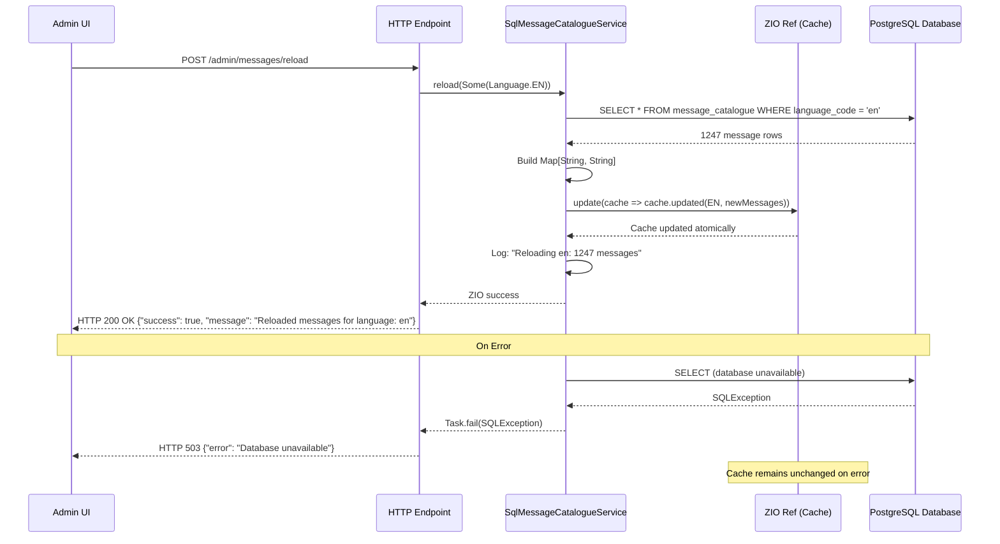

# Message Catalogue Reload Mechanism

## Overview

The SQL-backed Message Catalogue supports hot reloading of messages from the database without restarting the application. This enables admin UI workflows where users update messages and immediately see changes in the running application.

## Reload Method Signature

```scala
def reload(language: Option[Language]): Task[Unit]
```

**Location:** `SqlMessageCatalogueService` (concrete class, not on `MessageCatalogueService` trait)

**Parameters:**
- `language: Option[Language]` - Language to reload, or `None` to reload all configured languages

**Returns:**
- `Task[Unit]` - ZIO effect that completes when reload finishes

**Errors:**
- Returns database errors to caller if reload fails
- Existing cache remains unchanged on error (atomic update via ZIO Ref)

## Design Decision: Why Not on the Trait?

The `reload()` method is on `SqlMessageCatalogueService` (concrete class) rather than on the `MessageCatalogueService` trait because:

1. **JSON implementation cannot reload** - JSON messages are bundled with application code
2. **Implementation-specific feature** - Only SQL-backed catalogues support runtime reload
3. **Type safety** - Prevents calling reload on implementations that don't support it

To call reload, downcast to the concrete type:

```scala
val service: MessageCatalogueService = // ... from ZIO environment

service match {
  case sql: SqlMessageCatalogueService =>
    sql.reload(Some(Language.EN))
  case _ =>
    ZIO.fail(new UnsupportedOperationException("Reload not supported"))
}
```

## When to Call Reload

Call `reload()` after updating messages in the database, typically from:

1. **Admin UI** - After user saves message changes
2. **Batch update script** - After bulk message import or translation
3. **API endpoint** - Manual reload via HTTP POST request

**Do NOT** call reload:
- During normal message retrieval (no reload needed - messages are cached)
- On every request (reload is for occasional updates, not every lookup)
- From background jobs unless messages changed

## Reload Behavior

### Reload Single Language

```scala
// Reload only English messages
val reloadEnglish: Task[Unit] =
  sqlService.reload(Some(Language.EN))
```

**What happens:**
1. Queries database: `SELECT * FROM message_catalogue WHERE language_code = 'en'`
2. Builds new message map: `Map[String, String]`
3. Updates cache atomically: `cacheRef.update(cache => cache.updated(Language.EN, newMessages))`
4. Logs completion: `"Reloading en: 1247 messages"`

**Performance:** ~50-100ms for 5K messages

### Reload All Languages

```scala
// Reload all configured languages
val reloadAll: Task[Unit] =
  sqlService.reload(None)
```

**What happens:**
1. Gets list of configured languages from current cache
2. Queries database for each language in parallel: `ZIO.foreachPar`
3. Builds complete new cache: `Map[Language, Map[String, String]]`
4. Replaces entire cache atomically: `cacheRef.set(newCache)`
5. Logs completion: `"Reloaded 3 languages: 3612 total messages"`

**Performance:** ~100-200ms for 10K messages across 3 languages

## Error Handling

### Errors Returned to Caller

```scala
val reloadProgram = for {
  service <- ZIO.service[SqlMessageCatalogueService]
  _ <- service.reload(Some(Language.EN))
    .catchAll { error =>
      ZIO.logError(s"Failed to reload messages: ${error.getMessage}") *>
      ZIO.fail(error)  // Propagate error to caller
    }
} yield ()
```

### Cache Unchanged on Error

If reload fails (e.g., database unavailable), the existing cache remains unchanged:

```scala
// Before reload: 1000 messages in cache
service.reload(Some(Language.EN))  // Fails with SQLException

// After failed reload: Still 1000 messages in cache
// Application continues serving old messages
```

This ensures the application remains functional even if reload fails.

### Atomic Updates

Cache updates use ZIO `Ref` for atomic, thread-safe operations:

```scala
// Single language: atomic update of one map entry
cacheRef.update(cache => cache.updated(lang, messages))

// All languages: atomic replacement of entire cache
cacheRef.set(newCache)
```

Concurrent reload calls are serialized automatically by ZIO Ref.

## Performance Impact

| Operation | Message Count | Duration | Impact on Users |
|-----------|---------------|----------|-----------------|
| Reload single language | 1K messages | ~20ms | Negligible |
| Reload single language | 5K messages | ~50ms | Negligible |
| Reload single language | 10K messages | ~100ms | Negligible |
| Reload all languages (3) | 15K messages | ~150ms | Negligible |
| Reload all languages (5) | 25K messages | ~200ms | Minimal |

**During reload:**
- Application continues serving requests normally
- Message lookups use existing cache (no interruption)
- New cache becomes available atomically after reload completes

**After reload:**
- New messages immediately available to all requests
- No restart required
- No downtime

## Reload Logging

Reload operations log progress for monitoring and debugging:

### Single Language Reload

```
[info] Reloading en: 1247 messages
```

### All Languages Reload

```
[info] Reloading all languages: en, cs, de
[info] Reloaded 3 languages: 3612 total messages
```

### Error Logs

Errors are logged but not automatically handled - caller must handle errors:

```scala
// Logs appear if reload fails
[error] Failed to reload messages: Connection refused
```

## Admin UI Integration

### Example: HTTP Endpoint for Message Reload

```scala
import zio.*
import zio.http.*
import works.iterative.core.Language
import works.iterative.core.service.MessageCatalogueService
import works.iterative.core.service.impl.SqlMessageCatalogueService

case class ReloadRequest(language: Option[String])
case class ReloadResponse(success: Boolean, message: String)

val reloadEndpoint: HttpApp[MessageCatalogueService] =
  Routes(
    Method.POST / "admin" / "messages" / "reload" -> handler { (req: Request) =>
      for {
        // Parse request body
        body <- req.body.asString
        reloadReq <- ZIO.fromEither(body.fromJson[ReloadRequest])
          .mapError(err => Response.badRequest(s"Invalid request: $err"))

        // Get service and downcast to SQL implementation
        service <- ZIO.service[MessageCatalogueService]
        sqlService <- service match {
          case sql: SqlMessageCatalogueService => ZIO.succeed(sql)
          case _ => ZIO.fail(Response.status(Status.NotImplemented))
        }

        // Parse language if provided
        language <- reloadReq.language match {
          case Some(lang) =>
            ZIO.attempt(Language.unsafe(lang))
              .mapError(_ => Response.badRequest(s"Invalid language: $lang"))
              .map(Some(_))
          case None => ZIO.succeed(None)
        }

        // Reload messages
        _ <- sqlService.reload(language)
          .mapError { error =>
            Response.internalServerError(s"Reload failed: ${error.getMessage}")
          }

        // Return success response
        response = ReloadResponse(
          success = true,
          message = language match {
            case Some(lang) => s"Reloaded messages for language: $lang"
            case None => "Reloaded messages for all languages"
          }
        )
      } yield Response.json(response.toJson)
    }
  ).toHttpApp
```

### Example: Admin UI Reload Button

```typescript
// Frontend TypeScript/JavaScript
async function reloadMessages(language?: string) {
  try {
    const response = await fetch('/admin/messages/reload', {
      method: 'POST',
      headers: { 'Content-Type': 'application/json' },
      body: JSON.stringify({ language: language || null })
    });

    if (!response.ok) {
      const error = await response.text();
      throw new Error(error);
    }

    const result = await response.json();
    alert(result.message);  // "Reloaded messages for language: en"
  } catch (error) {
    alert(`Failed to reload messages: ${error.message}`);
  }
}

// Reload button handlers
document.getElementById('reload-en').addEventListener('click', () => {
  reloadMessages('en');
});

document.getElementById('reload-all').addEventListener('click', () => {
  reloadMessages();  // No language = reload all
});
```

### Error Mapping for HTTP Responses

```scala
import zio.http.*

def mapReloadErrors(error: Throwable): Response = error match {
  case _: java.sql.SQLException =>
    Response.status(Status.ServiceUnavailable)
      .copy(body = Body.fromString("Database unavailable"))

  case _: java.util.concurrent.TimeoutException =>
    Response.status(Status.RequestTimeout)
      .copy(body = Body.fromString("Reload timeout"))

  case other =>
    Response.internalServerError(s"Reload failed: ${other.getMessage}")
}

// Use in endpoint
sqlService.reload(language)
  .mapError(mapReloadErrors)
```

## Reload Flow Sequence Diagram



## Concurrent Reload Safety

ZIO `Ref` provides atomic updates, serializing concurrent reload calls:

```scala
// Thread 1 calls reload
service.reload(Some(Language.EN))

// Thread 2 calls reload simultaneously
service.reload(Some(Language.CS))

// ZIO Ref ensures:
// 1. Both reloads complete successfully
// 2. Cache updates don't conflict
// 3. Final cache contains both updates
```

**Reload operations are safe to call concurrently** - ZIO Ref serializes updates automatically.

## Testing Reload in Development

```scala
import zio.*
import zio.test.*
import works.iterative.core.Language

object ReloadSpec extends ZIOSpecDefault {

  def spec = suite("Message Catalogue Reload")(
    test("reload single language updates cache") {
      for {
        // Setup: Create service with initial messages
        service <- createTestService(
          Language.EN -> Map("key1" -> "value1")
        )

        // Update database with new messages
        repo <- ZIO.service[MessageCatalogueRepository]
        _ <- repo.bulkInsert(Seq(
          MessageCatalogueData(MessageId("key2"), Language.EN, "value2", None, None)
        ))

        // Reload
        _ <- service.reload(Some(Language.EN))

        // Verify new message available
        catalogue <- service.forLanguage(Language.EN)
        message = catalogue(MessageId("key2"))
      } yield assertTrue(message == "value2")
    },

    test("reload failure leaves cache unchanged") {
      for {
        // Setup: Create service with initial messages
        service <- createTestService(
          Language.EN -> Map("key1" -> "value1")
        )

        // Simulate database failure
        _ <- shutdownDatabase

        // Attempt reload (will fail)
        result <- service.reload(Some(Language.EN)).exit

        // Verify reload failed
        _ <- assertTrue(result.isFailure)

        // Verify old message still available
        catalogue <- service.forLanguage(Language.EN)
        message = catalogue(MessageId("key1"))
      } yield assertTrue(message == "value1")
    }
  )
}
```

## Best Practices

### 1. Call Reload After Database Updates

```scala
// Good: Reload after update
for {
  _ <- updateMessageInDatabase(messageId, newText)
  _ <- service.reload(Some(language))
} yield ()

// Bad: Update without reload
updateMessageInDatabase(messageId, newText)
// Users still see old message until application restarts
```

### 2. Handle Reload Errors Gracefully

```scala
// Good: Handle errors, inform user
service.reload(language).catchAll { error =>
  ZIO.logError(s"Reload failed: $error") *>
  notifyUser("Changes saved but reload failed. Restart application to see changes.")
}

// Bad: Ignore errors
service.reload(language).ignore
// User thinks reload succeeded but cache still has old messages
```

### 3. Reload Only When Needed

```scala
// Good: Reload after batch update
for {
  _ <- bulkUpdateMessages(updates)
  _ <- service.reload(None)  // One reload for all changes
} yield ()

// Bad: Reload after each message
updates.foreach { update =>
  updateMessage(update)
  service.reload(Some(update.language))  // Too many reloads!
}
```

### 4. Monitor Reload Performance

```scala
// Good: Track reload duration
for {
  start <- Clock.nanoTime
  _ <- service.reload(language)
  end <- Clock.nanoTime
  duration = (end - start) / 1_000_000  // Convert to milliseconds
  _ <- ZIO.logInfo(s"Reload completed in ${duration}ms")
  _ <- ZIO.when(duration > 500)(
    ZIO.logWarning(s"Reload took longer than expected: ${duration}ms")
  )
} yield ()
```

## FAQ

### Can I reload while users are accessing messages?

Yes. Reload operations don't block message lookups. Users continue accessing the old cache until the new cache is atomically swapped in.

### What happens if reload fails?

The existing cache remains unchanged. Users continue seeing old messages. The error is returned to the caller for handling.

### How often should I reload?

Only when messages change. Typical scenarios:
- After admin UI saves message updates (immediate)
- After batch import from translation service (once per batch)
- Manual reload via admin endpoint (on demand)

### Can I reload multiple languages simultaneously?

Yes, use `reload(None)` to reload all languages in parallel. This is more efficient than reloading each language individually.

### Is reload thread-safe?

Yes. ZIO Ref provides atomic updates. Concurrent reload calls are serialized automatically.

### How do I know if reload succeeded?

Check the returned `Task[Unit]`:
- Success: Task completes without errors
- Failure: Task fails with exception (e.g., SQLException)

Always handle errors explicitly in production code.
