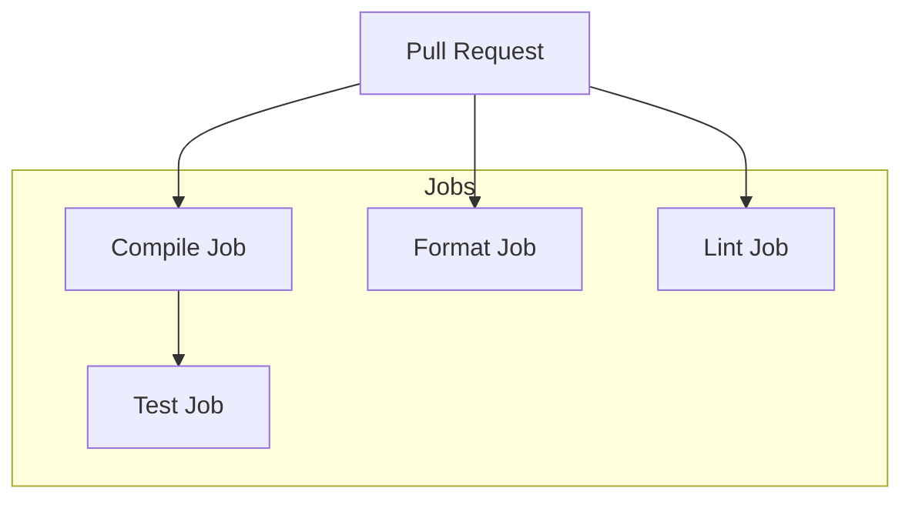

# Review Packet: Phase 04 - CI runs test suite on PR

**Issue:** SUPP-9
**Phase:** 4
**Created:** 2026-01-30

## Goals

Add test execution to the CI workflow so PRs are validated for functional correctness via the test suite, not just compilation, formatting, and linting.

## Scenarios

- [x] Test job runs after compilation succeeds (via `needs: compile`)
- [x] Test job executes `./mill __.test` for all modules
- [ ] MongoDB tests skip gracefully in CI (no MONGO_URI) - to verify when PR runs
- [ ] SQL tests (Testcontainers) work in CI - to verify when PR runs
- [ ] Test output visible in GitHub Actions logs - to verify when PR runs

## Entry Points

Start reviewing at:
1. `.github/workflows/ci.yml:125-162` - New test job definition

## Architecture Diagram



The test job depends on compile (via `needs: compile`) but runs in parallel with format and lint jobs.

## Test Summary

- **No new tests added** - this phase adds CI infrastructure only
- **Existing tests verified locally** - all tests pass with `./mill __.test`
- **SQL tests (Testcontainers)** - work locally, should work in CI
- **MongoDB tests** - auto-skip without MONGO_URI env var

## Files Changed

```
M .github/workflows/ci.yml
```

## Key Changes

1. **Updated PURPOSE comment** to include "tests" in the description
2. **Added test job** (lines 125-162):
   - `needs: compile` - runs after compilation succeeds
   - Same infrastructure setup as other jobs (Java 21, caching)
   - Runs `./mill __.test` for all modules

## Review Checklist

- [ ] Job dependency correct (`needs: compile`)
- [ ] Same caching strategy as other jobs
- [ ] Test command correct (`./mill __.test`)
- [ ] Permissions sufficient (read contents/packages)
